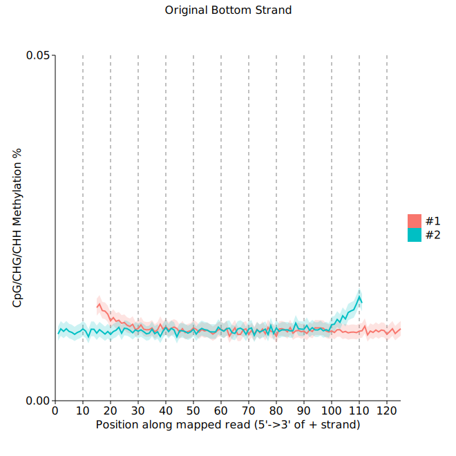

This document describes the output produced by the pipeline.

## Pipeline overview
The pipeline is built using [Nextflow](https://www.nextflow.io/) and processes data using the following steps:

* [Indexing](#indexing) - indexing of the reference genome
* [FastQC](#fastqc) - read quality control
* [cutadapt](#cutadapt) - adapter trimming
* [Alignment](#alignment) - aligning reads to reference genome
* [Alignment Statistics](#alignment-statistics) - basic statistics for the final alignment file(s)
* [Picard MarkDuplicates](#picard-markduplicates) - deduplicating reads
* [Methyldackel](#methyldackel) - methylation calling
* [Conversion Rate Estimation](#conversion-rate-estimation) - using lambda or a specified reference scaffold/contig
* [Pipeline Info](#pipeline-info) - reports from nextflow about the pipeline run

### Output Directory Structure


## Indexing
The alignment tools used by the pipeline require indexed reference genomes in order to run. By default the pipeline will assume these have been generated already, unless either `--index` or `--keepIndex` have been specified in which case the pipeline will create the files based on the given parameters for the run.

**Output directory: `wgbs/`**

* `reference.ebm` and/or `reference.{ctidx,gaidx}`
  * If the reference genome has to be indexed during the pipeline run, it will be saved here prior to alignment.
  * **NB:** Only saved if `--keepIndex`, is specified when running the pipeline.

## FastQC
[FastQC](http://www.bioinformatics.babraham.ac.uk/projects/fastqc/) gives general quality metrics about your reads. It provides information about the quality score distribution across your reads, the per base sequence content (%T/A/G/C). You get information about adapter contamination and other overrepresented sequences.

For further reading and documentation see the [FastQC help](http://www.bioinformatics.babraham.ac.uk/projects/fastqc/Help/).

> **NB:** The FastQC plots are generated either for the input reads directly, or for the _trimmed_ reads depending on whether or not the `--trim` parameter has been specified.

**Output directory: `wgbs/[SAMPLE]/fastq/`**

* `[SAMPLE]_fastqc.html`
  * FastQC report, containing quality metrics for your untrimmed raw fastq files
* `[SAMPLE]_fastqc.zip`
  * zip file containing the FastQC report, tab-delimited data file and plot images

## cutadapt
The pipeline uses [cutadapt](https://github.com/marcelm/cutadapt/) for removal of adapter contamination and trimming of low quality regions, unless trimming has been performed previously and the `--trim` parameter is therefore not specified for the run.

**Output directory: `wgbs/[SAMPLE]/fastq/`**

Contains FastQ files with quality and adapter trimmed reads for each sample, along with a log file describing the trimming.

* `[SAMPLE]_1.fq.gz`, `[SAMPLE]_2.fq.gz`
  * Trimmed FastQ data, reads 1 and 2.
  * **NB:** Only saved if `--keepReads` has been specified.
* `logs/[SAMPLE].log`
  * Trimming report (describes which parameters that were used)

> Single-end data will have slightly different file names and only one FastQ file per sample.

## Alignment
Bisulfite read alignment by default is carried out by [erne-bs5](http://erne.sourceforge.net/), an efficient aligner based on a 5-letter sequence alphabet and an index built on a Burrows-Wheeler Transformation (BWT). If either the `--merge` or `--segemehl` options have been given then [segemehl](https://www.bioinf.uni-leipzig.de/Software/segemehl/) will be used alongside/instead to imporove mapping sensitivity and specificity at the cost of runtime and additional computational resource allocation.

**Output directory: `wgbs/[SAMPLE]/bam/`**

* `raw.erne-bs5.bam` and/or `raw.segemehl.bam`
  * Aligned reads in BAM format from the initial alignment.
  * **NB:** Only saved if `--keepBams`, is specified when running the pipeline.
* `logs/raw.erne-bs5.log` and/or `logs/raw.segemehl.log`
  * Log file produced by the initial alignment of each tool.
* `proc.erne-bs5.bam` and/or `proc.segemehl.bam`
  * Post-processed BAM files that are corrected for .
  * **NB:** Only saved if it is the *final file* or if `--keepBams`, is specified when running the pipeline.
* `merged.bam`
  * Combined alignment file containing `proc.erne-bs5.bam` and `proc.segemehl.bam` if the `--merge` option is given.
  * **NB:** Only saved if it is the *final file* or if `--keepBams`, is specified when running the pipeline.
* `uniq.bam` and `mult.bam`
  * Alignment files containing unique and multimapping alignments, respectively, depending on the usage of the `--unique` parameter.
  * **NB:** Only saved if `--keepBams`, is specified when running the pipeline.

> The final alignment file will be symlinked to this location: `wgbs/[SAMPLE]/[SAMPLE].bam`

## Alignment Statistics
A combination of [samtools](http://www.htslib.org/) utilities `samtools stats` and `plot-bamstats` are used to generate simple alignment statistics on the final BAM files for each sample.

**Output directory: `wgbs/[SAMPLE]/stats/`**

* `[SAMPLE].bam.stats`
  * The raw text data output from `samtools stats` which is used to generate plots.


* `bam/coverage.png`
  * The raw text data output from `samtools stats` which is used to generate plots.


* `bam/gc-content.png`
  * The raw text data output from `samtools stats` which is used to generate plots.


* `bam/gc-depth.png`
  * The raw text data output from `samtools stats` which is used to generate plots.


* `bam/acgt-cycles.png`
  * The raw text data output from `samtools stats` which is used to generate plots.


* `bam/quals-hm.png`
  * The raw text data output from `samtools stats` which is used to generate plots.


* `bam/quals.png`
  * The raw text data output from `samtools stats` which is used to generate plots.


* `bam/quals2.png`
  * The raw text data output from `samtools stats` which is used to generate plots.


* `bam/quals3.png`
  * The raw text data output from `samtools stats` which is used to generate plots.


* `bam/insert-size.png`
  * The raw text data output from `samtools stats` which is used to generate plots.


* `bam/indel-dist.png`
  * The raw text data output from `samtools stats` which is used to generate plots.


* `bam/indel-cycles.png`
  * The raw text data output from `samtools stats` which is used to generate plots.

## Picard MarkDuplicates
This step marks alignments with identical mapping position as duplicates to avoid processing of technical duplicates arising from eg. PCR in the results. Note that it is skipped if `--noDedup` is specified when running the pipeline.

**Output directory: `wgbs/[SAMPLE]/bam/`**

* `markDups.bam`
  * BAM file with marked alignments.
  * **NB:** Only saved if `--keepBams`, is specified when running the pipeline.
* `logs/markDups.log`
  * Log file for Picard MarkDuplicates.

**Output directory: `wgbs/[SAMPLE]/stats/`**

* `duplicates.txt`
  * Summary statistics for the marked duplicates.

## Methyldackel
The methylation extractor step takes a BAM file with aligned reads and generates files containing cytosine methylation calls in whichever contexts (CpG,CHG,CHH) have been specified during the run. It produces a few different output formats, described below.

**Output directory: `wgbs/[SAMPLE]/bedGraph/`**

* `[SAMPLE]_{CpG,CHG,CHH}.bedGraph`
  * bedGraph files with methylation information for each position, depending on context.

**Output directory: `wgbs/[SAMPLE]/stats/`**




* `Mbias_{OT,OB}.svg`
  * Analysis of methylation bias at the ends of reads, used for soft-clipping during methylation calling.

Filename abbreviations stand for the following reference alignment strands:
* `OT` - Original Top strand
* `OB` - Original Bottom strand

## Conversion Rate Estimation
Conversion rate refers to the efficiency of the sodium-bisulfite treatment during the cytosine conversion step of the library preparation prior to sequencing. This is usually estimated by calculating the proportion of non-converted cytosines in an unmethylated sequence, which could either be eg. a chloroplast chromosome which is part of the reference and has been specified with `--chrom`, or a "spike-in" of DNA such as _E. coli_ Bacteriophage Lambda which has it's own reference genome specified with the `--split` parameter.

**Output directory: `wgbs/[sample]/stats/`**

* `BisNonConvRate.txt`
  * A text file containing the % non-conversion rate from estimated from a scaffold within the reference genome and/or from an alternative source such as Lambda.

```
sampleA     J02459.1        Non-conversion Rate (%): 0.0414893
sampleA     chloroplast     Non-conversion Rate (%): 0.0547547
```

**Output directory: `wgbs/[sample]/bam/`**

* `subset.bam`
  * If a DNA "spike-in" has been used during library preparation, this has to be included in the reference during alignment and subsequently removed from the final bam file. This file contains only alignments to the given reference genome.
  * **NB:** Only present in the absence of `--noLambda`, or if `--split` is specified when running the pipeline.

> The final alignment file will be symlinked to this location: `wgbs/[SAMPLE]/[SAMPLE].bam`

## Pipeline Info
Nextflow has several built-in reporting tools that give information about the pipeline run.

**Output directory: `wgbs/`**

* `dag.svg`
  * DAG graph giving a diagrammatic view of the pipeline run.
  * NB: If [Graphviz](http://www.graphviz.org/) was not installed when running the pipeline, this file will be in [DOT format](http://www.graphviz.org/content/dot-language) instead of SVG.
* `report.html`
  * Nextflow report describing parameters, computational resource usage and task bash commands used.
* `timeline.html`
  * A waterfall timeline plot showing the running times of the workflow tasks.
* `trace.txt`
  * A text file with machine-readable statistics about every task executed in the pipeline.