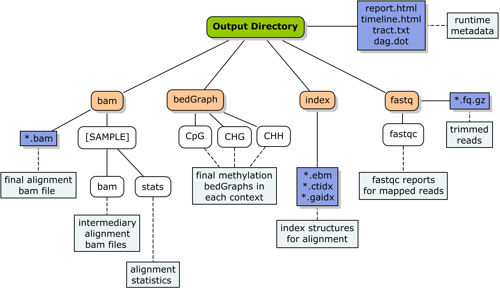

This document describes the output produced by the pipeline.

## Pipeline overview
The pipeline is built using [Nextflow](https://www.nextflow.io/) and processes data using the following steps:

* [FastQC](#fastqc) - read quality control
* [cutadapt](#cutadapt) - adapter trimming
* [Alignment](#alignment) - aligning reads to reference genome
* [Picard MarkDuplicates](#deduplication) - deduplicating reads
* [Methyldackel](#methylation-extraction) - methylation calling
* [Conversion Rate Estimation](#conversion-rate-estimation) - using lambda or a specified reference scaffold/contig
* [Pipeline Info](#pipeline-info) - reports from nextflow about the pipeline run

## Pipeline Info
Nextflow has several built-in reporting tools that give information about the pipeline run.

**Output directory: `wgbs/`**

* `dag.svg`
  * DAG graph giving a diagrammatic view of the pipeline run.
  * NB: If [Graphviz](http://www.graphviz.org/) was not installed when running the pipeline, this file will be in [DOT format](http://www.graphviz.org/content/dot-language) instead of SVG.
* `report.html`
  * Nextflow report describing parameters, computational resource usage and task bash commands used.
* `timeline.html`
  * A waterfall timeline plot showing the running times of the workflow tasks.
* `trace.txt`
  * A text file with machine-readable statistics about every task executed in the pipeline.