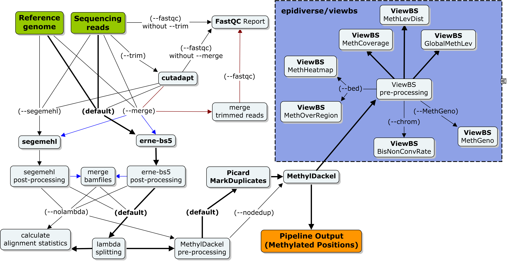
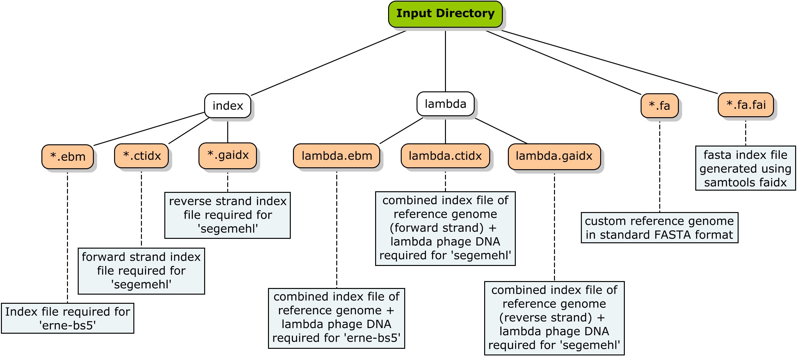

# EpiDiverse-WGBS Usage
This document describes the parameter options used by the pipeline.

* [Running the pipeline](#running-the-pipeline)
* [Inputs and outputs](#inputs-and-outputs)
    * [`--input`](#--input-arg-required)
    * [`--merge`](#--merge-arg)
    * [`--SE`](#--SE)	
    * [`--output`](#--output-arg)
* [Reference genomes](#reference-genomes)
    * [`--reference`](#--reference-arg-required)
    * [`--index`](#--index)
    * [`--split`](#--split-arg)
    * [`--chrom`](#--chrom-arg)
* [Adapter trimming](#adapter-trimming)
    * [`--fastqc`](#--fastqc)
* [Read alignment](#read-alignment)
    * [`--segemehl`](#--segemehl)
    * [`--unique`](#--unique)
* [Additional parameters](#additional-parameters)
    * [`--noCpG`](#--noCpG)
    * [`--noCHG`](#--noCHG)
    * [`--noCHH`](#--noCHH)
    * [`--noLambda`](#--noLambda)
    * [`--noDedup`](#--noDedup)
    * [`--keepReads`](#--keepReads)
    * [`--keepBams`](#--keepBams)
    * [`--debug`](#--debug)
    * [`--version`](#--version)
    * [`--help`](#--help)
* [Software dependencies](#software-dependencies)
    * [`-profile`](#-profile)
    * [`-with-conda`](#-with-conda)
    * [`-with-docker`](#-with-docker)
    * [`-with-singularity`](#-with-singularity)
* [Other command line parameters](#other-command-line-parameters)
    * [`-work-dir`](#-work-dir)
    * [`-params-file`](#-params-file)
    * [`-config`](#-config)
    * [`-resume`](#-resume)
    * [`-name`](#-name)

## Workflow



## Running the pipeline
The main command for running the pipeline is as follows:

```bash
nextflow run epidiverse/wgbs [OPTIONS]
```

Note that the pipeline will create files in your working directory:

```bash
work/           # Directory containing the nextflow working files
wgbs/           # Finished results (configurable, see below)
.nextflow_log   # Log file from Nextflow
.nextflow/      # Nextflow cache and history information
```

## Inputs and Outputs

### `--input <ARG>` [REQUIRED]
Specify the path to the DIRECTORY containing the reads for analysis. All fastq files must be in compressed `*{1,2}.fastq.gz` format for PE reads, with separate files for R1 and R2, or in `*.fastq.gz` format for SE reads. PE and SE reads cannot be processed together, but any number of read sets of the same type may be included and they will be analysed in parallel. The input directory must contain at least one set of appropriate files for the pipeline to initiate.

### `--merge <ARG>`
Specify the path to a DIRECTORY containing a subset of input reads for higher precision analysis. The pipeline will analyse the `--input` reads using [erne-bs5](#read-alignment) and the `--merge` reads using [segemehl](#--segemehl). The file names in each directory must be identical, and all files must follow the same nomenclature as described for the `--input` parameter. Any number of read sets may be included, and they will be analysed in parallel. The individual reads specified in the `--merge` files must also be absent from the `--input` files. [default: off]

### `--SE`
Interpret input reads as SINGLE END instead of PAIRED END. Reads in this format must follow the `*.fastq.gz` nomenclature. [default: off]

### `--output <ARG>`
Specify the path to the output directory. [default: wgbs]

## Reference Genomes
If you specify a custom reference genome for analysis, the pipeline expects a relative directory structure as pictured below. White boxes indicate sub-folders, and orange boxes indicate files. Blue boxes give a description of each file. If any files are missing, then associated processes may raise errors.



### `--reference <ARG>` [REQUIRED]
Path to the reference genome FILE should be in fasta format, with a corresponding fasta index file `*.fai` in the same directory. The appropriate `*.ebm` index for erne-bs5 or `*.ctidx` and `*.gaidx` index files for segemehl are also required. The lambda index is used for estimating bisulfite conversion rate with whichever spike-in is specified with the [`--split`](#--split-arg) option, otherwise the standard index is used.  

### `--index`
If no index exists for the reference genome, this option can be specified in order to build an index which is appropriate to the alignment strategy outlined in the given pipeline run. [default: off]

### `--split <ARG>`
If you have used a custom spike-in to estimate conversion efficiency in place of 'lambda phage', then you must specify the path to the standalone fasta for splitting the alignments. NOTE: there must also be a corresponding fasta index '*.fa.fai' file in the same directory. [default: data/lambda.fa]

### `--chrom <ARG>`
Specify the scaffold/contig from which to estimate conversion efficiency following alignment. Can be combined with a spike-in estimation eg. lambda, as the calculation will be made from the given contig without splitting the alignment file. [default: off]

## Adapter Trimming
By default the pipeline will assume that pre-trimmed reads have been given to the [`--input`](#--input-arg-required) parameter, and will therefore skip the trimming process unless specified. Trimmimg will be performed with cutadapt which takes into consideration a number of additional parameters:

`--trim`

Specify to enable trimming. [default: off]

`--forward <ARG>`

The forward adapter sequence. [default: AGATCGGAAGAGCACACGTCTGAAC]

`--reverse <ARG>`

The reverse adapter sequence. [default: AGATCGGAAGAGCGTCGTGTAGGGA]

`--clip5 <ARG>`

Number of bases for hard clipping at the 5'-end. [default: 0]

`--clip3 <ARG>`

Number of bases for hard clipping at the 3'-end. [default: 0]

`--minQual <ARG>`

Minimum base quality threshold for trimming. [default: 20]

`--minLeng <ARG>`

Minimum length threshold of trimmed sequences. [default: 36]

`--minOver <ARG>`

Minimum overlap length for adapter sequences in reads. [default: 3]

### `--fastqc`
Generate fastqc report for sequencing reads. Report will be generated for trimmed reads if the adapter trimming process has been enabled. [default: off]

## Read Alignment
Bisulfite read alignment by default is carried out by [erne-bs5](http://erne.sourceforge.net/), an efficient aligner based on a 5-letter sequence alphabet and an index built on a Burrows-Wheeler Transformation (BWT). Several additional parameters can also be provided to modify the mapping results:

`--minIns <ARG>`

The minimum insert size between PE reads. [default: 0]

`--maxIns <ARG>`

The maximum insert size between PE reads. [default: 500]

`--maxErrors <ARG>`

Specify the maximum number of base errors allowed during read alignment with 'erne-bs5'. This will disable the default auto-error function. [default: off]

`--XF <ARG>`

Specify a proportion of opposite-strand bisulfite mismatches to allow before filtering. This excludes reads in regions that appear to have undergone genome rearrangement to the opposite strand, as alignment in this case is unreliable. [default: 0.03]

### `--segemehl`
Enable bisulfite read alignment using only [segemehl](https://www.bioinf.uni-leipzig.de/Software/segemehl/). This aligner has higher precision but is more memory and time intensive than 'erne-bs5'. It is suitable for smaller analyses or for redoing analyses on "interesting" samples. [default: off]

`--minAccuracy <ARG>`

Specify the minimum percentage threshold for base matches during read alignment with 'segemehl'. [default: 90]

### `--unique`
Specify that only uniquely-mapping reads should be used in downstream methylation calling. [default: off]


## Additional Parameters

### `--noCpG`
Do not call methylated positions in CpG context. Note: at least one methylation context is required for analysis. [default: off]

### `--noCHG`
Do not call methylated positions in CHG context. Note: at least one methylation context is required for analysis. [default: off]

### `--noCHH`
Do not call methylated positions in CHH context. Note: at least one methylation context is required for analysis. [default: off]

### `--noLambda`
If your protocol does not include a spike-in from which to estimate conversion efficiency, then specify this parameter to disable the automatic alignment to eg. lambda genome for this purpose. [default: off]

### `--noDedup`
Skip the deduplication step with Picard MarkDuplicates if for example your protocol does not include PCR. [default: off]

### `--keepIndex`
Save the generated genome index files to the output directory. This option can be used either alongside or in place of [`--index`](#--index). [default: off]

### `--keepReads`
Specify that any trimmed reads generated by the pipeline should be kept after analysis. [default: off]

### `--keepBams`
Specify that any intermediate bam files generated by the pipeline should be kept after analysis, rather than only the final bam file. [default: off]

### `--debug`
Specify in order to prevent Nextflow from clearing the work dir cache following a successful pipeline completion. [default: off]

### `--version`
When called with `nextflow run epidiverse/wgbs --version` this will display the pipeline version and quit.

### `--help`
When called with `nextflow run epidiverse/wgbs --help` this will display the parameter options and quit.

## Software Dependencies

There are different ways to provide the required software dependencies for the pipeline. The recommended method is to use the Conda, Docker or Singularity profiles as provided by the pipeline. 

### `-profile`
Use this parameter to choose a preset configuration profile. See the [installation documentation](https://app.gitbook.com/@epidiverse/s/project/epidiverse-pipelines/installation) for more information about profiles.

Profiles available with the pipeline are:

* `standard`
    * The default profile, used if `-profile` is not specified.
    * Uses sensible resource allocation for , runs using the `local` executor (native system calls) and expects all software to be installed and available on the `$PATH`.
    * This profile is mainly designed to be used as a starting point for other configurations and is inherited by most of the other profiles below.
* `conda`
    * Builds a conda environment from the environment.yaml file provided by the pipeline
    * Requires conda to be installed on your system.
* `docker`
    * Launches a docker image pulled from epidiverse/wgbs
    * Requires docker to be installed on your system. 
* `singularity`
    * Launches a singularity image pulled from epidiverse/wgbs
    * Requires singularity to be installed on your system.
* `epi|diverse`
    * Designed to be used on the [EpiDiverse](http://epidiverse.eu/) clusters `epi` or `diverse`
    * Launches jobs using the `SLURM` executor.
    * Uses pre-built conda environments to provide all software requirements.
    * Comes with built in --thlaspi, --fragaria and --populus shortcuts for reference paths.
* `custom`
    * No configuration at all. Useful if you want to build your own config from scratch and want to avoid loading in the default `base` config for process resource allocation.

If you wish to provide your own package containers it is possible to do so by setting the `standard` or `custom` profile, and then providing your custom package with the command line flags below. These are not required with the the other profiles.

### `-with-conda <ARG>`
Flag to enable conda. You can provide either a pre-built environment or a *.yaml file.

### `-with-docker <ARG>`
Flag to enable docker. The image will automatically be pulled from Dockerhub.

### `-with-singularity <ARG>`
Flag to enable use of singularity. The image will automatically be pulled from the internet. If running offline, follow the option with the full path to the image file.

## Other command line parameters

### `-work-dir <ARG>`
Specify the path to a custom work directory for the pipeline to run with (eg. on a scratch directory)

### `-params-file <ARG>`
Provide a file with specified parameters to avoid typing them out on the command line. This is useful for carrying out repeated analyses. A template params file [`assets/params.txt`](../assets/params.txt) has been made available in the pipeline repository.

### `-config <ARG>`
Provide a custom config file for adapting the pipeline to run on your own computing infrastructure. A template config file [`assets/custom.config`](../assets/custom.config) has been made available in the pipeline repository. This file can be used as a boilerplate for building your own custom config.

### `-resume [<ARG>]`
Specify this when restarting a pipeline. Nextflow will used cached results from any pipeline steps where the inputs are the same, continuing from where it got to previously. Give a specific pipeline name as an argument to resume it, otherwise Nextflow will resume the most recent. NOTE: This will not work if the specified run finished successfully and the cache was automatically cleared. (see: [`--debug`](#--debug))

### `-name <ARG>`
Name for the pipeline run. If not specified, Nextflow will automatically generate a random mnemonic.
